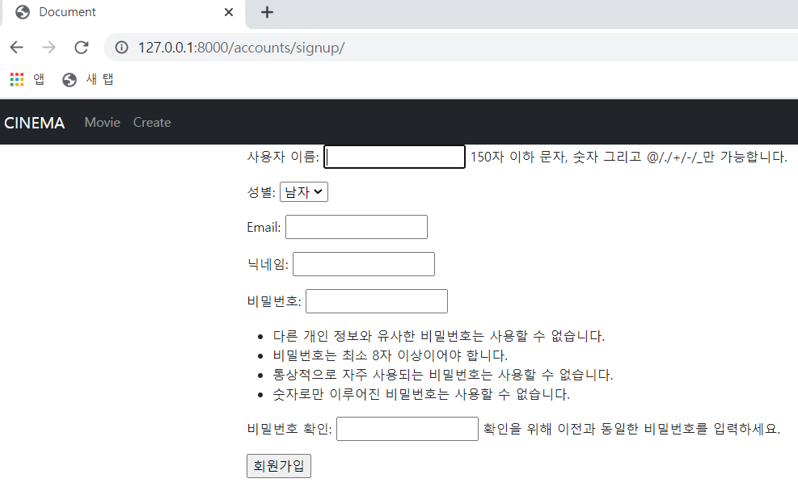

# 🛫 Done 🥳

#### :one:. ~~회원가입 페이지~~

#### :two:. ~~로그인 페이지~~

#### :three:. ~~회원정보 수정 페이지~~ --> 닉네임 변경을 일정기간 마다 가능하게 구성, 사용자와 수정하고자 하는 닉네임 불일치 시 404페이지로 보내도록 구성

#### :four:. ~~비밀번호 수정 페이지~~  --> 전에 바꿨던 비밀번호로 변경할 경우 동작

#### :five:. index 페이지

#### :six:. detail 페이지

#### :seven:. 좋아요 댓글 기능 추가

<br>

<br>

<br>

# :one: 회원가입 페이지

<br>

#### • 수정 및 구현사항 계획

1. ##### 회원가입 시 바로 로그인

2. ##### 닉네임 추가

>나중에 네이버로 로그인, 구글 로그인 활용 시에 이 사용자들의 ID는 이메일 주소가 될 것으로 예상
>
>그러면 댓글이나 게시글 작성 시에 작성자 이름에 이메일 주소가 들어오게 된다.
>
>작성자명에 이메일 주소를 사용 시에 길이가 긴 문제와 덜 친근해..보이는? 문제가 예상된다 ㅋㅋㅋ

<br>

#### • 실제 수정 및 구현사항

1. ##### 회원가입 시 바로 로그인

2. ##### 닉네임 Column 추가, unique 값으로 지정, label을 활용하여 실제 페이지에서 지정한 값으로 시각화

3. ##### Email Column 추가 및 unique 값으로 지정

<br>

- ###### 회원가입 시 바로 로그인 views.py

```python
from django.contrib.auth import login as auth_login

def signup(request):
    if request.method == 'POST':
        form = CustomUserCreationForm(request.POST)
        if form.is_valid():
            user = form.save()
            auth_login(request, user)
            return redirect('contents:index')
    else:
        form = CustomUserCreationForm()
    context = {
        'form' : form,
    }
    return render(request, 'accounts/signup.html', context)
```

<br>

- 닉네임 및 Email 수정사항

```python
# models.py
class User(AbstractUser):
    gender = models.BooleanField()
    nickname = models.CharField(max_length=20, unique=True)
    email = models.EmailField(unique=True)
```

>unique=True를 해줘서 nickname column안의 값을 유일하게 만들어주었다.
>
>사용자들끼리 nickname이 같다면 구분하기가 어렵기 때문이다.
>
>Id로 사용할 수도 있지만 이메일로 가입하는 사용자들은 ID에 email 값이 할당되기 때문에
>
>너무 길어 보이거나 식별이 어려울 수 있는 문제가 생길 여지가 있다.

<br>

```python
# forms.py
    nickname = forms.CharField(label='닉네임')
    class Meta(UserCreationForm.Meta):
        model = get_user_model()
        fields = UserCreationForm.Meta.fields + ('gender', 'email', 'nickname',)
```

>nickname의 값을 받는 줄에 닉네임이라는 label을 달아주기 위해서 label을 활용했다.
>
>fields에 + 하는 값의 순서를 변경하여 실제 화면에서 순서로 변경할 수 있다.

<br>

<br>

## 수정 전


<br>

## 수정 후



<br>

<br>

<br>

# :two:. 로그인 페이지

<br>

#### • 수정 및 구현사항 계획

1. ##### Django 로그인 Form을 활용하여 구현

   >구글, 네이버, 페북 등으로 로그인은 나중에 구현하고 먼저 로그인 기능이 잘 돌아가도록 해보자

2. ##### 로그인 후에는 index 페이지로 이동

   > 특정 페이지로 들어가서 @login_required에 의해 로그인 페이지로 넘어갈 경우
   >
   > 로그인 후에 그 페이지로 넘겨줄수도 있다.
   >
   > 메인페이지에서 로그인을 먼저 받아놓으면 이런 기능을 넣을 필요가 없어진다.
   >
   > 그렇다면.. 선택은?

<br>

#### • 실제 수정 및 구현사항

1. Django 로그인 Form을 활용하여 구현 및 로그인 성공 후 index 페이지로 이동

   ```python
   # views.py
   from django.contrib.auth import login as auth_login
   
   def login(request):
       if request.user.is_authenticated:
           return redirect('contents:index')
       if request.method == 'POST':
           form = AuthenticationForm(request, request.POST)
           if form.is_valid():
               auth_login(request, form.get_user())
               return redirect('contents:index')
       else:
           form = AuthenticationForm()
       context = {
           'form' : form,
       }
       return render(request, 'accounts/login.html', context)
   ```

   >로그인을 한 사용자인 경우 index 페이지로 보내줘서 접근을 막는다
   >
   >로그인 완료 후 index 페이지로 보내준다.

   <br>

<br>

<br>

# :three:. 회원정보 수정 페이지

<br>

#### • 수정 및 구현사항 계획

1. ##### Django의 UserChangeForm을 활용하여 구현

   >ModelForm으로 Custom해서 사용
   >
   >음.. 사용자가 악의적으로 닉네임을 계속 바꿔서 서버에 무리를 줄 수도 있으니까
   >
   >15일에 한번씩 바꿀 수 있도록 닉네임 변경을 활성화 비활성화 할 수 있을까?
   >
   >일단 기능부터 하고 나중에 생각해볼까?

<br>

#### • 실제 수정 및 구현사항

1. ##### Django의 UserChangeForm을 활용하여 구현

   ```python
   def profile(request, nickname):
       user = get_user_model()
       if request.user == user.objects.get(nickname=nickname):
           if request.method == 'POST':
               form = CustomUserChangeForm(data=request.POST, instance=request.user)
               if form.is_valid():
                   user_info = form.save()
                   return redirect('accounts:profile', user_info.nickname)
           else:
               form = CustomUserChangeForm(instance=request.user)
           context = {
               'form' : form,
           }
           return render(request, 'accounts/profile.html', context)
   ```

   >정보 수정을 하려는 사용자와 nickname을 통해 불러온 사용자가 같으면 수정이 가능하도록 구성해주었다.
   >
   >다를 경우에는 404 페이지로 보내는 것도 추가해봐야겠다.
   >
   >수정 완료 시에는 profile 페이지 즉 수정 페이지로 다시 돌아가게 구성했다.

<br>

<br>

<br>

# :four:. 비밀번호 수정 페이지

<br>

#### • 수정 및 구현사항 계획

1. ##### Django의 PasswordChangeForm을 활용하여 구현

   > 전에 사용했던 비밀번호로 바꾸려고 할 경우 불가능하게 구현 해볼까?
   >
   > 이미 Form에서 제공하고 있을까?

   <br>

#### • 실제 수정 및 구현사항

1. ##### Django의 PasswordChangeForm을 활용하여 구현

   ```python
   def password(request):
       if request.method == 'POST':
           form = PasswordChangeForm(request.user, request.POST)
           if form.is_valid():
               user_info = form.save()
               update_session_auth_hash(request, form.user)
               return redirect('accounts:profile', user_info.nickname)
       else:
           form = PasswordChangeForm(request.user)
       context = {
           'form' : form,
       }
       return render(request, 'accounts/password.html', context)
   ```

   - 오류

     ```python
     # urls.py
     
     from django.urls import path
     from . import views
     
     app_name = 'accounts'
     
     urlpatterns = [
         path('signup/', views.signup, name='signup'),
         path('login/', views.login, name='login'),
         path('logout/', views.logout, name='logout'),
         path('profile/password/', views.password, name='password'),
         path('profile/<nickname>/', views.profile, name='profile'),
     ]
     ```

     >profile/<nickname>/이 profile/password/ 보다 위에 있어서 password를 nickname으로 인식하는 문제가 발생했다.
     >
     >그래서 profile 함수로 값이 계속 넘어가는 상황이었다.
     >
     >둘의 위치를 바꿔줘서 해결했다.
     >
     >앞으로 페이지가 커진다고 하면 이런 상황이 더 자주 발생할 것 같다.
     >
     >설계의 중요성!