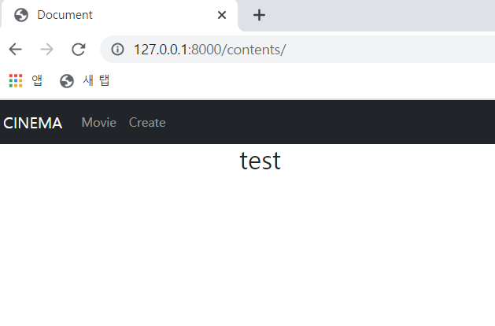

# 📃 Todo 🥳

 

#### :one:. 회원가입 페이지

#### :two:. 로그인 페이지

#### :three:. 회원정보 수정 페이지

#### :four:. 비밀번호 수정 페이지

#### :five:. index 페이지

#### :six:. detail 페이지

#### :seven:. 좋아요 댓글 기능 추가

 

 
 

# :one: 회원가입 페이지

 

#### • 수정 전

=======
 

#### • 수정 및 구현사항

1. ##### 회원가입 시 바로 로그인

2. ##### 닉네임 추가

>나중에 네이버로 로그인, 구글 로그인 활용 시에 이 사용자들의 ID는 이메일 주소가 될 것으로 예상
>
>그러면 댓글이나 게시글 작성 시에 작성자 이름에 이메일 주소가 들어오게 된다.
>
>작성자명에 이메일 주소를 사용 시에 길이가 긴 문제와 덜 친근해..보이는? 문제가 예상된다 ㅋㅋㅋ

 

 

 

# :two: 로그인 페이지

 

#### • 수정 및 구현사항

1. ##### Django 로그인 Form을 활용하여 구현

   >구글, 네이버, 페북 등으로 로그인은 나중에 구현하고 먼저 로그인 기능이 잘 돌아가도록 해보자

2. ##### 로그인 후에는 index 페이지로 이동

   > 특정 페이지로 들어가서 @login_required에 의해 로그인 페이지로 넘어갈 경우
   >
   > 로그인 후에 그 페이지로 넘겨줄수도 있다.
   >
   > 메인페이지에서 로그인을 먼저 받아놓으면 이런 기능을 넣을 필요가 없어진다.
   >
   > 그렇다면.. 선택은?

 

 

 

# :three: 회원정보 수정 페이지

 

#### • 수정 및 구현사항

1. ##### Django의 UserChangeForm을 활용하여 구현

   >ModelForm으로 Custom해서 사용
   >
   >음.. 사용자가 악의적으로 닉네임을 계속 바꿔서 서버에 무리를 줄 수도 있으니까
   >
   >15일에 한번씩 바꿀 수 있도록 닉네임 변경을 활성화 비활성화 할 수 있을까?
   >
   >일단 기능부터 하고 나중에 생각해볼까?

 

 

 

# :four: 비밀번호 수정 페이지

 

#### • 수정 및 구현사항

1. ##### Django의 PasswordChangeForm을 활용하여 구현

   > 전에 사용했던 비밀번호로 바꾸려고 할 경우 불가능하게 구현 해볼까?
   >
   > 이미 Form에서 제공하고 있을까?

 

 

 

# :five: index 페이지

 

#### • 수정 전

 

#### • 수정 및 구현사항

1. ##### 임시 데이터를 삽입하여 데이터가 화면에 잘 출력되는지 확인(기능 테스트를 우선적으로)

 

 

 

# :six: detail 페이지

 

#### • 수정 및 구현사항

1. ##### 임시 데이터를 삽입하여 데이터가 화면에 잘 출력되는지 확인

 

 

 

# :seven: 좋아요 댓글 기능 추가

 

#### • 수정 및 구현사항

1. ##### 좋아요 기능추가

   >게시글 좋아요, 댓글 좋아요, 유튜브 영상 좋아요
   >
   >유튜브 영상은 기존 영상의 좋아요를 가져올건지 사이트의 좋아요를 따로 할건지 결정

2. ##### 댓글 기능추가

   >대댓글...?(할래?ㅋㅋㅋㅋㅋㅋ 일단 나중에..)
