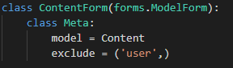
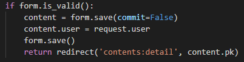
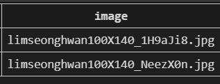
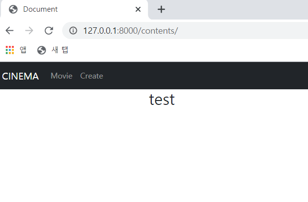
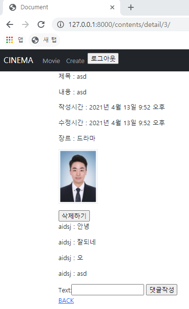
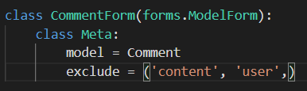

# 🛫 Done 🥳

<br>

#### ~~:one:. 게시글 Create 페이지~~

#### ~~:two:. 게시글 Update 페이지~~

#### ~~:three:. 게시글 Delete 기능~~

#### ~~:four:. index 페이지~~ --> 글 번호, 작성자, 좋아요 갯수 추가 필요

#### ~~:five:. detail 페이지~~ --> 글 번호, 작성자, 좋아요 갯수 추가 필요

#### :six:. 좋아요 ~~댓글 기능 추가~~ --> 좋아요 기능 추가

#### :seven:. My page --> My page 작성 필요

<br>

<br>

<br>

# :one: 게시글 Create 페이지

<br>

#### • 구현 계획

1. ##### Form과 ModelForm 활용

   >글 작성 페이지는 글 번호, 제목, 글 내용, 장르를 받아야 하지만
   >
   >게시글 테이블을 짤 때는 좋아요 한 유저, 이 게시글을 좋아하는 유저 등을 고려해야한다

<br>

#### • 실제 구현

1. ##### Form과 ModelForm을 활용

   >글 작성자를 식별하기 위해서 1:N ForeignKey Column 생성
   >
   >제목 컬럼 생성
   >
   >내용 컬럼 생성
   >
   >컨텐츠 포스터를 넣을 이미지 컬럼 생성
   >
   >장르를 선택해 줄 장르 컬럼 생성
   >
   >게시글 생성 시간 컬럼 생성
   >
   >게시글 수정 시간 컬럼 생성

   ```python
   class Content(models.Model):
       drama = '드라마'
       action = '액션'
       thriller = '스릴러'
       romance = '로맨스'
       mystery = '미스테리'
       sf = 'SF'
       genrn_choices = [
           (drama, '드라마'),
           (action, '액션'),
           (thriller, '스릴러'),
           (romance, '로맨스'),
           (mystery, '미스테리'),
           (sf, 'SF'),
       ]
       
       user = models.ForeignKey(settings.AUTH_USER_MODEL, on_delete=models.CASCADE)
       title = models.CharField(max_length=50)
       content = models.TextField()
       image = models.ImageField()
       genre = models.CharField(max_length=10, choices=genrn_choices)
       created_at = models.DateTimeField(auto_now_add=True)
       updated_at = models.DateTimeField(auto_now=True)
   ```

   >ForeignKey의 첫번째 인자는 참조할 모델을 넣어준다. 
   >
   >settings.AUTH_USER_MODEL은 accounts.User인데 이 User는 AbstractUser를 상속 받고 
   >
   >AbstractUser는 AbstractBaseUser와 PermissionsMixin을 상속 받고 있다.
   >
   >ForeignKey의 두번째 인자는 참조하는 모델이 삭제 되었을 경우 어떻게 처리될지를 설정해주는 것이다.
   >
   >CASCADE의 경우 참조하는 모델이 삭제되었을 때 ForeignKey를 포함하는 row를 같이 삭제해준다.
   >
   >
   >
   >user column은 게시글 작성 시에 사용자가 작성하는 것이 아니라 작성자의 PK 값을 할당해줘야 하기 때문에
   >
   >ModelForm에서 제외해주고 백단에서 작성자의 pk 값을 할당해준다.
   >
   >

   <br>

   >ImageField는 이미지 파일을 받아주는 컬럼인데 Pillow 라이브러리 설치가 필요하다.
   >
   >imageField는 sqlite3에 이미지 파일을 저장하는 것이 아닌 파일 이름을 저장한다.
   >
   >
   >
   >위와 같이 저장된다.

   <br>

   >장르 컬럼은 CharField에 choices 속성을 지정해주었다.
   >
   >genre_choices에서 choices 후보들을 가져온다.

   <br>

   ```pyt
   # views.py
   
   def create(request):
       if request.method == 'POST':
           form = ContentForm(request.POST, files=request.FILES)
           if form.is_valid():
               content = form.save(commit=False)
               content.user = request.user
               form.save()
               return redirect('contents:detail', content.pk)
       else:
           form = ContentForm()
       context = {
           'form' : form,
       }
       return render(request, 'contents/form.html', context)
   ```

   >이미지 파일을 받고 media에 저장하기 위해서 files=request.FILES 속성을 추가해준다.
   >
   >content.user = request.user를 통해서 게시글 작성자의 pk 값을 게시글의 user에 할당해준다.

<br>

<br>

<br>

# :two: 게시글 Update 페이지

<br>

#### • 구현 계획

1. ##### Form과 ModelForm 활용

   >글 제목, 글 내용, 장르를 수정가능하게 한다.
   >
   >혹시 수정하면 안되거나 자주 수정하면 안되는 내용이 있을까?

2. ##### 게시글 수정 후 detail 페이지로 이동

<br>

#### • 실제 구현

1. ##### Form과 ModelForm을 활용

   >글 제목, 글 내용, 장르, 이미지 파일을 수정 가능하게 해주었다.
   >
   >```python
   >def update(request, content_id):
   >    content = get_object_or_404(Content, pk=content_id)
   >    if request.user == content.user:
   >        if request.method == 'POST':
   >            form = ContentForm(request.POST, instance=content, files=request.FILES)
   >            if form.is_valid():
   >                content = form.save()
   >                return redirect('contents:detail', content_id)
   >        else:
   >            form = ContentForm(instance=content)
   >        context = {
   >            'form' : form,
   >        }
   >        return render(request, 'contents/form.html', context)
   >    else:
   >        return redirect('contents:detail', content_id)
   >```
   >
   >get_object_or_404를 활용하여 없는 게시글에 접근했을 떄 404 페이지로 가도록 해주었다.
   >
   >request.user == content.user를 활용하여 수정하려는 요청자하고 게시글 작성자가 일치한지 확인해준 후에
   >
   >수정 과정이 진행되도록 해주었다.
   >
   ><br>
   >
   >```html
   >
   >
   >    
   >        <h2>Create</h2>
   >    
   >        <h2>Update</h2>
   >    
   >    <form action="" method='POST' enctype="multipart/form-data">
   >        
   >        {{ form.as_p }}
   >        <input type="submit" value="작성">
   >    </form>
   >    <a href="">BACK</a>
   >
   >```
   >
   >request.resolver_mathch.url_name은 어떤 경로에서 이 페이지로 들어왔는지 식별해준다.
   >
   >create와 update의 form은 같은 틀을 사용해도 되기 때문에 
   >
   >create 페이지인지 update 페이지인지 식별해주는 텍스트 파일만 바꿔주면 된다.
   >
   >enctype은 form data가 서버로 제줓될 때 해당 데이터가 인코딩되는 방법을 명시해주는 것이다.
   >
   >method가 POST일 때만 사용가능하다.
   >
   >enctype="multipart/form-data"를 지정해줘서 모든 문자를 인코딩 하지 않는 것으로 설정해준다.
   >
   >주로 파일이나 이미지에 사용되는 속성이다.

<br>

<br>

<Br>

# :three: 게시글 Delete 기능

<br>

#### • 구현 계획

1. ##### 게시글 삭제 후 index 페이지로 이동

<BR>

#### • 실제 구현

1. ##### 게시글 삭제 후 index 페이지로 이동

2. ###### 게시글 작성자와 삭제 요청하는 사용자가 일치하지 않을 경우 detail 페이지로 redirect

   ```python
   @require_POST
   def delete(request, content_id):
       content = get_object_or_404(Content, pk=content_id)
       if request.user == content.user:
           content.delete()
           return redirect('contents:index')
       else:
           return redirect('contents:detail', content_id)
   ```

   >@require_POST 미디어를 설정해줘서 포스트 요청일 경우에만 메서드가 실행되도록 해주었다.
   >
   >get 요청으로 할 경우 405에러가 발생한다.

<br>

<br>

<br>

# :four: index 페이지

<br>

#### • 수정 전



<br>

#### • 구현 계획

1. ##### 임시 데이터를 삽입하여 데이터가 화면에 잘 출력되는지 확인(기능 테스트를 우선적으로)

   >글 번호, 제목, 작성자, 게시글의 좋아요 갯수표시

   <br>

#### • 실제 구현

1. ##### 임시 데이터를 삽입하여 데이터가 화면에 잘 출력되는지 확인

   > 제목 이미지 출력
   >
   > 
   >
   > <br>
   >
   > 글 번호, 작성자를 추가해주고 좋아요 기능 구현해서 추가해줘야 한다.
   >
   > ```html
   > 
   > 
   > 
   >     
   >         <h2>{{ request.user.nickname }} 합격</h2>
   >         <a href="">글쓰기</a>
   >     
   >     
   >         <p>제목 : <a href="">{{ content.title }}</a></p>
   >         
   >     
   > 
   > ```
   >
   > 로그인 됐을 경우에는 메세지와 글쓰기 버튼을 활성화해준다.

<br>

<br>

<br>

# :five: detail 페이지

<br>

#### • 구현계획

1. ##### 임시 데이터를 삽입하여 데이터가 화면에 잘 출력되는지 확인

   >글 번호, 제목, 작성자, 생성일, 수정일, 게시글의 좋아요 갯수, 좋아요하고 즐겨찾기? 버튼을 나눠야할듯

   <br>

#### • 실제 구현

1. ##### 임시 데이터를 삽입하여 데이터가 화면에 잘 출력되는지 확인

   >글 제목, 글 내용, 생성일, 수정일, 장르, 댓글을 출력했다.
   >
   >
   >
   ><br>
   >
   >```html
   >
   >
   >    <p>제목 : {{ content.title }}</p>
   >    <p>내용 : {{ content.content }}</p>
   >    <p>작성시간 : {{ content.created_at }}</p>
   >    <p>수정시간 : {{ content.updated_at }}</p>
   >    <p>장르 : {{ content.genre }}</p>
   >    <p></p>
   >    
   >        <form action="" method='POST'>
   >            
   >            <input type="submit" value='삭제하기'>
   >        </form>
   >    
   >    
   >        <p>{{ comment.user.nickname }} : {{ comment.text }}</p>
   >    
   >    
   >        <form action="" method='POST'>
   >            
   >            {{ form }}
   >            <input type="submit" value="댓글작성">
   >        </form>
   >    
   >    <a href="">BACK</a>
   >
   >```
   >
   >작성자와 요청자가 같을 때만 글 삭제 버튼이 활성화 되도록 구성했다.
   >
   >게시글의 댓글을 댓글 작성자와 내용을 함께 출력했고
   >
   >로그인 했을 경우에만 댓글을 작성할 수 있도록 구성했다.

<br>

<br>

<br>

# :six: 좋아요 댓글 기능 추가

<br>

#### • 구현계획

1. ##### 좋아요 기능추가

   >게시글 좋아요, 댓글 좋아요
   >
   >유튜브 영상은 기존 영상의 좋아요를 가져올건지 사이트의 좋아요를 따로 할건지 결정

2. ##### 댓글 기능추가

   >대댓글...?(할래?ㅋㅋㅋㅋㅋㅋ 일단 나중에..)

   <br>

#### • 실제 구현

1. ##### 댓글 기능추가

   >```python
   >class Comment(models.Model):
   >    user = models.ForeignKey(settings.AUTH_USER_MODEL, on_delete=models.CASCADE)
   >    content = models.ForeignKey(Content, on_delete=models.CASCADE)
   >    text = models.CharField(max_length=200)
   >    created_at = models.DateTimeField(auto_now_add=True)
   >    updated_at = models.DateTimeField(auto_now=True)
   >```
   >
   >게시글 작성자를 나타내줄 user ForeignKey Column과
   >
   >댓글이 작성된 게시글을 나타내줄 content ForeignKey Column을 생성했다.
   >
   ><br>
   >
   >```python
   >@require_POST
   >def create_comment(request, content_id):
   >    content = get_object_or_404(Content, pk=content_id)
   >    if request.user.is_authenticated:
   >        form = CommentForm(request.POST)
   >        if form.is_valid():
   >            comment = form.save(commit=False)
   >            comment.user = request.user
   >            comment.content = content
   >            comment.save()
   >            return redirect("contents:detail", content_id)
   >        # context = {
   >        #     'form' : form,
   >        # }
   >        # return render(request, 'contents/detail.html', context)
   >    return redirect("contents:detail", content_id)
   >```
   >
   >댓글 작성 시에 user 컬럼과 content 컬럼에 값을 줘야하기 때문에 작성자와 게시글 정보를 user와 content에 할당해준다.
   >
   >content는 게시글의 정보가 담겨있는 객체인데 사실 comment.content에는 게시글의 id 값이 들어가야한다.
   >
   >근데 객체를 전부 넣어줘도 알아서 할당되는 듯하다.
   >
   >아래 context는 안넘겨줘도 잘 돌아간다. 사실 context를 넘겨주려면 render로 넘겨줘야하는데 애초에 render가 없기 떄문에
   >
   >없어도 잘 돌아가는 것 같다.
   >
   ><br>
   >
   >
   >
   >사용자가 댓글 작성시에 게시글과 작성하는 user의 id 값은 백단에서 할당해줘야 하기 때문에 
   >
   >ModelForm 설정 시에 제외해준다.

<br>

<br>

<br>