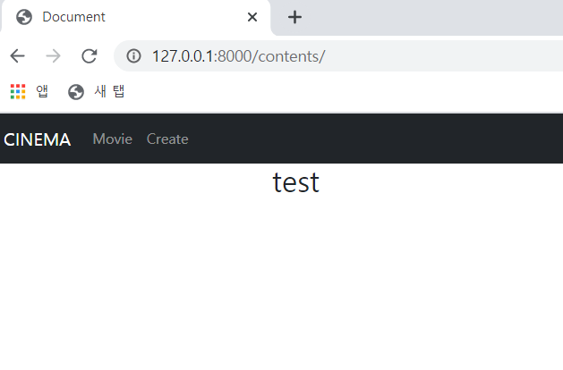

# 📃 Todo 🥳

 

#### :one:. 게시글 Create 페이지

#### :two:. 게시글 Update 페이지

#### :three:. 게시글 Delete 기능

#### :four:. index 페이지

#### :five:. detail 페이지

#### :six:. 좋아요 댓글 기능 추가

#### :seven:. My page

 

 

 

# :one: 게시글 Create 페이지

 

#### • 구현 계획

1. ##### Form과 ModelForm 활용

   >글 작성 페이지는 글 번호, 제목, 글 내용, 장르를 받아야 하지만
   >
   >게시글 테이블을 짤 때는 좋아요 한 유저, 이 게시글을 좋아하는 유저 등을 고려해야한다

 

 

 

# :two: 게시글 Update 페이지

 

#### • 구현 계획

1. ##### Form과 ModelForm 활용

   >글 제목, 글 내용, 장르를 수정가능하게 한다.
   >
   >혹시 수정하면 안되거나 자주 수정하면 안되는 내용이 있을까?

2. ##### 게시글 수정 후 detail 페이지로 이동

 

 

 

# :three: 게시글 Delete 기능

 

#### • 구현 계획

1. ##### 게시글 삭제 후 index 페이지로 이동

 

 

 

# :four: index 페이지

 

#### • 수정 전

 

#### • 구현 계획

1. ##### 임시 데이터를 삽입하여 데이터가 화면에 잘 출력되는지 확인(기능 테스트를 우선적으로)

   >글 번호, 제목, 작성자, 게시글의 좋아요 갯수표시

 

 

 

# :five: detail 페이지

 

#### • 구현계획

1. ##### 임시 데이터를 삽입하여 데이터가 화면에 잘 출력되는지 확인

   >글 번호, 제목, 작성자, 생성일, 수정일, 게시글의 좋아요 갯수, 좋아요하고 즐겨찾기? 버튼을 나눠야할듯

 

 

 

# :six: 좋아요 댓글 기능 추가

 

#### • 구현계획

1. ##### 좋아요 기능추가

   >게시글 좋아요, 댓글 좋아요
   >
   >유튜브 영상은 기존 영상의 좋아요를 가져올건지 사이트의 좋아요를 따로 할건지 결정

2. ##### 댓글 기능추가

   >대댓글...?(할래?ㅋㅋㅋㅋㅋㅋ 일단 나중에..)

 

 

 

# :seven: My page

 

#### • 구현계획

1. ##### 좋아요한 게시글과 나중에 볼 게시글 분리

   >내가 그냥 영상이 좋아서 좋아요했고 나중에 또 볼지 안볼지는 사실 미정
   >
   >나중에 볼 영상은 좋아요에 상관 없이 내가 나중에 보고싶음
   >
   >
   >
   >내가 좋아요한 영상과 나중에 볼 영상을 장르별로 나누기 위해서는
   >
   >좋아요나 나중에 볼 영상정보와 함께 장르 데이터가 같이 넘어와야함
   >
   >테이블 잘 짜보자!

