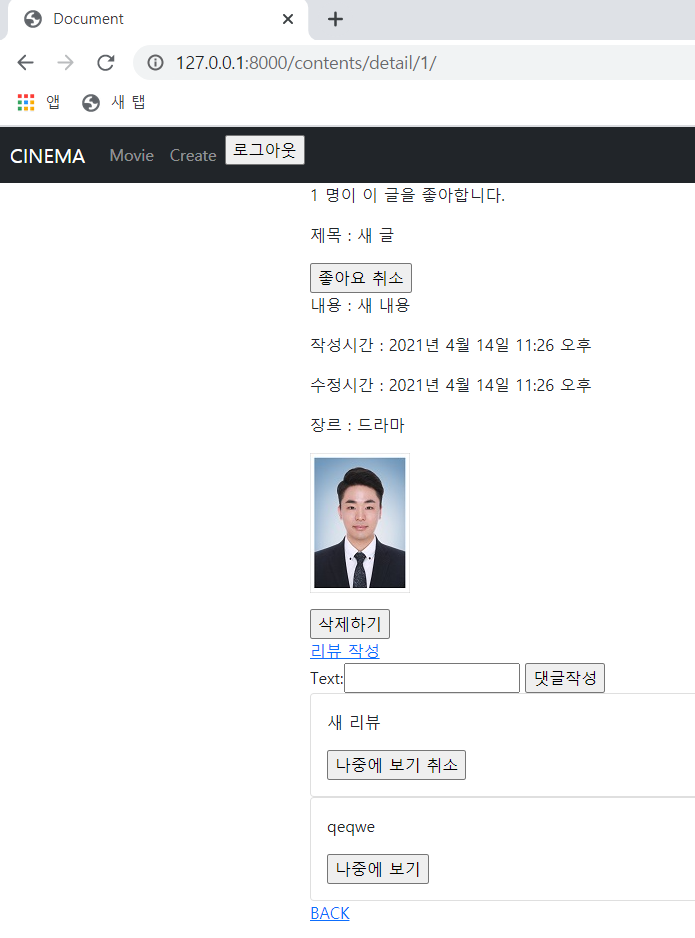

# 🛫 Done 🥳

<br>

#### ~~:one:. 댓글 삭제 기능 추가~~

#### ~~:two:. 좋아요 기능 추가~~

#### ~~:three:. My page~~   --> My Page에 좋아요한 게시글과 나중에 볼 게시글 출력

#### :four:. My Profile 시청기록 추가

#### :five:. My Profile 통계 추가

<br>

<br>

<br>

# :one: 댓글 삭제 기능 추가

<br>

#### • 구현계획

1. ##### 댓글 삭제 기능 추가

   >댓글 삭제 요청을 한 사용자와 댓글 작성자가 일치하면 
   >
   >삭제 버튼을 시각화해서 삭제 가능하게 구성

<br>

#### • 실제 구현

1. 댓글 삭제 기능 추가

   >get_object_or_404 메서드를 활용하여 삭제하려는 comment가 있는 경우 삭제해주고 없는 경우에는 404 페이지를 보여준다.
   >
   >```python
   >@require_POST
   >def delete_comment(request, content_id, comment_id):
   >    comment = get_object_or_404(Comment, pk=comment_id)
   >    comment.delete()
   >    return redirect('contents:detail', content_id)
   >```
   >
   >>POST 방식만 받고 있기 때문에 URL로는 접근이 안된다.
   >>
   >>그러면 버튼을 눌러서만 삭제가 가능하다는 것이다. 
   >>
   >>이 말은 POST 방식으로만 접근이 가능하며 댓글이 있어야 버튼도 있기 때문에 버튼 말고는 댓글을 삭제할 수 있는 방법이 없다.
   >>
   >>그러니까 삭제하고자 하는 댓글이 없으면 버튼도 없기 때문에 get_object_or_404에서 404 페이지를 만나기가 어렵지 않을까 생각된다.
   >>
   >>만약 있다면 사용자가 2개의 같은 페이지를 켜놓고 한 페이지 에서는 댓글을 삭제하고 다른 페이지에서 새로고침을 누르지 않고 댓글삭제 버튼을 또 누른다면 404를 만날 수 있다.

<br>

<br>

<br>

# :two: 좋아요 기능 추가

<br>

#### • 구현계획

1. ##### 게시글 좋아요 기능 추가

   >ManyToManyField와 ModelForm을 활용하여 구현

<br>

2. ##### 댓글 좋아요 기능 추가

   >ManyToManyField와 ModelForm을 활용하여 구현

<br>

#### • 실제 구현

1. ##### 게시글 좋아요 기능 추가

   >ManyToManyField에 related_name 값을 설정하여 구현했다.
   >
   >이렇게 해서 User 테이블과 Content 테이블은 각각 1:N과 N:M의 관계를 가지는 2가지 컬럼을 가지게 되었다.
   >
   >이 경우 유저가 작성한 모든 게시글을 보기 위한 역참조를 할 때와
   >
   >유저가 좋아하는 모든 게시글을 보기 위한 역참조를 할 때의 코드가 같아 진다. user.content_set.all()
   >
   >그래서 뒤에서 만든 like_user 컬럼 값에 related_name 속성을 주어서 역참조 시에는 like_content를 활용해서 역참조를 수행한다.
   >
   >```python
   ># models.py
   >class Content(models.Model):
   >    drama = '드라마'
   >    action = '액션'
   >    thriller = '스릴러'
   >    romance = '로맨스'
   >    mystery = '미스테리'
   >    sf = 'SF'
   >    genre_choices = [
   >        (drama, '드라마'),
   >        (action, '액션'),
   >        (thriller, '스릴러'),
   >        (romance, '로맨스'),
   >        (mystery, '미스테리'),
   >        (sf, 'SF'),
   >    ]
   >    
   >    user = models.ForeignKey(settings.AUTH_USER_MODEL, on_delete=models.CASCADE)
   >    like_users = models.ManyToManyField(settings.AUTH_USER_MODEL, related_name="like_contents")
   >    title = models.CharField(max_length=50)
   >    content = models.TextField()
   >    image = models.ImageField()
   >    genre = models.CharField(max_length=10, choices=genre_choices)
   >    created_at = models.DateTimeField(auto_now_add=True)
   >    updated_at = models.DateTimeField(auto_now=True)
   >```
   >
   ><br>
   >
   >```python
   ># views.py
   >@require_POST
   >def like_contents(request, content_id):
   >    if request.user.is_authenticated:
   >        content = get_object_or_404(Content, pk=content_id)
   >        if content.like_users.filter(pk=request.user.pk).exists():
   >            content.like_users.remove(request.user)
   >        else:
   >            content.like_users.add(request.user)
   >        return redirect('contents:detail', content_id)
   >    else:
   >        return redirect('accounts:login')
   >```
   >
   >좋아요를 누르기 위해서는 로그인을 해야하기 때문에 로그인이 되어있는지 확인하고 안되어 있다면 로그인 창으로 보내준다.
   >
   >로그인이 되어 있다면 좋아요 하고자 하는 게시글이 있는지 get_object_or_404로 확인해주고 좋아요를 누른 유저가 like_users 컬럼에 존재한다면 삭제를 해주고
   >
   >존재 하지 않는다면 추가를 해준다.
   >
   >화면 상에서는 좋아요 취소 / 좋아요로 구분한다.

<br>

2. ##### 댓글 좋아요 기능 추가

   >ManyToManyField와 ModelForm을 활용하여 구현
   >
   >```python
   >#models.py
   >class Comment(models.Model):
   >    user = models.ForeignKey(settings.AUTH_USER_MODEL, on_delete=models.CASCADE)
   >    like_users = models.ManyToManyField(settings.AUTH_USER_MODEL, related_name="like_comments")
   >    content = models.ForeignKey(Content, on_delete=models.CASCADE)
   >    text = models.CharField(max_length=200)
   >    created_at = models.DateTimeField(auto_now_add=True)
   >    updated_at = models.DateTimeField(auto_now=True)
   >```
   >
   >>댓글도 게시물과 마찬가지로 유저가 작성한 모든 댓글을 볼 때의 역참조 코드와 좋아요를 누른 모든 댓글을 볼 때의 역참조 코드가 같기 때문에 related_name 속성을 설정해준다.
   >
   ><br>
   >
   >```python
   >@require_POST
   >def like_comments(request, content_id, comment_id):
   >    if request.user.is_authenticated:
   >        comment = get_object_or_404(Comment, pk=comment_id)
   >        if comment.like_users.filter(pk=request.user.pk).exists():
   >            comment.like_users.remove(request.user)
   >        else:
   >            comment.like_users.add(request.user)
   >        return redirect('contents:detail', content_id)
   >    else:
   >        return redirect('accounts:login')
   >```
   >
   >>댓글 좋아요도 로그인 체크를 해주고 좋아요를 누른 유저가 comment 테이블의 like_users 컬럼에 존재하면 remove를 존재하지 않는다면 add를 해준다.

<br>

<br>

<br>

# :three: My page

<br>

#### • 구현계획

1. ##### 좋아요한 게시글과 나중에 볼 게시글 분리

   >내가 그냥 영상이 좋아서 좋아요했고 나중에 또 볼지 안볼지는 사실 미정
   >
   >나중에 볼 영상은 좋아요에 상관 없이 내가 나중에 보고싶음
   >
   >
   >
   >내가 좋아요한 영상과 나중에 볼 영상을 장르별로 나누기 위해서는
   >
   >좋아요나 나중에 볼 영상정보와 함께 장르 데이터가 같이 넘어와야함
   >
   >테이블 잘 짜보자!

<BR>

#### • 실제 구현

1. ##### 나중에 볼 게시글은 Content가 아닌 Review에 올라온 게시글을 선택하는게 맞다.

   >##### 유튜브 영상을 나중에 보려고는 해도 올라온 게시글 자체를 나중에 보진 않을 것이라고 판단했다.
   >
   >그래서 Review 컨텐츠에 나중에 보기 버튼을 만들어야하고 그러기 위해서는 Review 게시글이 필요하다
   >
   >Review 게시글을 CRUD할 기능 및 페이지를 구성하고 나중에 보기 버튼을 추가해줬다.
   >
   >```PYTHON
   >@require_POST
   >def see_later(request, content_id, review_id):
   >    if request.user.is_authenticated:
   >        review = get_object_or_404(Review, pk=review_id)
   >        if review.later_users.filter(pk=request.user.pk).exists():
   >            review.later_users.remove(request.user)
   >        else:
   >            review.later_users.add(request.user)
   >        return redirect('contents:detail', content_id)
   >    else:
   >        return redirect('accounts:login')
   >
   >
   >def create_review(request, content_id):
   >    if request.method == 'POST':
   >        content = Content.objects.get(pk=content_id)
   >        form = ReviewForm(request.POST, files=request.FILES)
   >        if form.is_valid():
   >            review = form.save(commit=False)
   >            review.user = request.user
   >            review.content = content
   >            form.save()
   >            return redirect('contents:detail', content.pk)
   >    else:
   >        form = ReviewForm()
   >    context = {
   >        'form' : form,
   >        'content_id' : content_id
   >    }
   >    return render(request, 'contents/reviewform.html', context)
   >
   >
   >@require_POST
   >def delete_review(request, content_id, review_id):
   >    review = get_object_or_404(Review, pk=review_id)
   >    if request.user == review.user:
   >        review.delete()
   >    return redirect('contents:detail', content_id)
   >
   >
   >
   >def update_review(request, content_id, review_id):
   >    review = get_object_or_404(Review, pk=review_id)
   >    if request.user == review.user:
   >        if request.method == 'POST':
   >            form = ReviewForm(request.POST, instance=review, files=request.FILES)
   >            if form.is_valid():
   >                review = form.save()
   >                return redirect('contents:detail', content_id)
   >        else:
   >            form = ReviewForm(instance=review)
   >        context = {
   >            'form' : form,
   >        }
   >        return render(request, 'contents/reviewform.html', context)
   >    else:
   >        return redirect('contents:detail', content_id)
   >```
   >
   >>see_later는 나중에 볼 컨텐츠를 추가해주는 기능인데 좋아요와 똑같이 동작한다.
   >>
   >>CRUD 기능은 Content를 등록할 때와 똑같이 동작한다.
   >>
   >><br>
   >
   >```python
   ># models.py
   >class Review(models.Model):
   >    user = models.ForeignKey(settings.AUTH_USER_MODEL, on_delete=models.CASCADE)
   >    content = models.ForeignKey(Content, on_delete=models.CASCADE)
   >    thumbnail = models.ImageField()
   >    later_users = models.ManyToManyField(settings.AUTH_USER_MODEL, related_name="later_reviews")
   >    title = models.CharField(max_length=100)
   >    hashtag = models.CharField(max_length=100)
   >    date = models.DateField()
   >```
   >
   >>Review 테이블도 Review 컨텐츠를 작성하는 유저가 있고 이 컨텐츠를 나중에 보기를 누르는 유저가 있다.
   >>
   >>유저가 작성한 모든 Review를 불러 올 때와 Review 컨텐츠를 좋아요 누른 모든 유저를 불러 올 때 역참조 코드가 같기 때문에 related_name 속성을 활용해주었다.
   >
   >
   >
   >>```html
   >>
   >>
   >>    <p>{{ content.like_users.all|length }} 명이 이 글을 좋아합니다.</p>
   >>    <p>제목 : {{ content.title }}</p>
   >>    <form action="" method='POST'>
   >>        
   >>        
   >>            <input type="submit" value="좋아요 취소">    
   >>        
   >>            <input type="submit" value="좋아요">
   >>        
   >>    </form>
   >>    <p>내용 : {{ content.content }}</p>
   >>    <p>작성시간 : {{ content.created_at }}</p>
   >>    <p>수정시간 : {{ content.updated_at }}</p>
   >>    <p>장르 : {{ content.genre }}</p>
   >>    <p></p>
   >>    
   >>        <form action="" method='POST'>
   >>            
   >>            <input type="submit" value='삭제하기'>
   >>        </form>
   >>    
   >>    <a href="">리뷰 작성</a>
   >>    
   >>        <p>{{ comment.user.nickname }} : {{ comment.text }} {{ comment.like_users.all|length }}</p>
   >>        
   >>            <form action="" method='POST'>
   >>                
   >>                <input type="submit" value='댓글삭제'>
   >>            </form>
   >>        
   >>        <form action="" method='POST'>
   >>            
   >>            
   >>                <input type="submit" value="좋아요 취소">
   >>            
   >>                <input type="submit" value="좋아요">
   >>            
   >>        </form>
   >>        <hr>
   >>    
   >>    
   >>        <form action="" method='POST'>
   >>            
   >>            {{ form }}
   >>            <input type="submit" value="댓글작성">
   >>        </form>
   >>    
   >>    
   >>        <div class="card">
   >>            <div class="card-body text-dark">
   >>                <p>{{ review.title }}</p>
   >>                <form action="" method='POST'>
   >>                    
   >>                    
   >>                        <input type="submit" value="나중에 보기 취소">
   >>                    
   >>                        <input type="submit" value="나중에 보기">
   >>                    
   >>                </form>
   >>            </div>
   >>        </div>
   >>    
   >>    <a href="">BACK</a>
   >>
   >>```
   >>
   >>현재 까지의 detail.html이다.
   >>
   >>너무 무거운가?

<br>

<br>

<br>