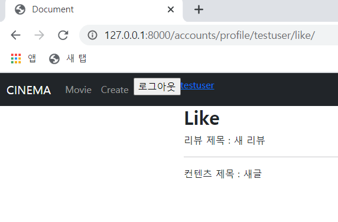

# 🛫 Done 🥳

<br>

#### ~~:one:. My Profile에 내가 좋아한 리뷰 탭 추가~~

#### ~~:two:. My Profile에 나중에 볼 리뷰 탭 추가~~

#### ~~:three:. My Profile 시청기록 탭 추가~~

#### ~~:four:. My Profile 통계 탭 추가~~ --> 통계에 들어갈 항목 미완성

<br>

<br>

<br>

# :one: My Profile에 내가 좋아한 리뷰 탭 추가

<br>

#### • 구현계획

1. ##### 내가 좋아한 리뷰 페이지 작성

   >좋아요 누른 리뷰를 보여줄 페이지를 구성

2. ##### 좋아한 리뷰 페이지에 좋아요를 누른 리뷰가 잘 올라오는지 확인

   >좋아요를 누른 리뷰의 pk 값을 가지고 그 리뷰의 이미지, 제목, 해시태그 등을 출력해서 보여준다.
   >
   >그러면 url에 request.user.pk 값을 user_id로 넘겨줘서
   >
   >content_like_users Table을 활용해서 content_id 값을 받아와야 할까?

<br>

#### • 실제 구현

1. ##### 내가 좋아한 리뷰 페이지 작성 및 컨텐츠와 리뷰가 잘 올라오는지 확인

   >
   >
   >좋아한 리뷰와 컨텐츠를 내가 좋아한 페이지에서 같이 볼 수 있도록 했다.
   >
   >나중에 볼 리뷰 페이지도 위와 같다.
   >
   ><br>
   >
   >```python
   ># models.py
   >class Review(models.Model):
   >    user = models.ForeignKey(settings.AUTH_USER_MODEL, on_delete=models.CASCADE)
   >    content = models.ForeignKey(Content, on_delete=models.CASCADE)
   >    like_users = models.ManyToManyField(settings.AUTH_USER_MODEL, related_name="like_reviews")
   >    later_users = models.ManyToManyField(settings.AUTH_USER_MODEL, related_name="later_reviews")
   >    watched_users = models.ManyToManyField(settings.AUTH_USER_MODEL, related_name='watched_reviews')
   >    thumbnail = models.ImageField()
   >    title = models.CharField(max_length=100)
   >    hashtag = models.CharField(max_length=100)
   >    date = models.DateField()
   >    genre = models.CharField(max_length=10)
   >```
   >
   >like_users는 review 입장에서 review를 좋아요 한 유저와 유저 입장에서 좋아요를 누른 review들을 조회할 수 있다.
   >
   >later_users는 나중에 볼 리뷰를 저장하기 위한 컬럼이다
   >
   >watched_users는 유저가 리뷰를 봤는지 안봤는지 체크하기 위함이다.
   >
   >유저가 시청한 컨텐츠의 장르를 통계낼 때 활용한다.
   >
   ><br>
   >
   >```python
   ># views.py
   >def mylike(request, nickname):
   >    if request.user.nickname == nickname:
   >        user = get_object_or_404(get_user_model(), nickname=nickname)
   >        like_contents = user.like_contents.all()
   >        like_reviews = user.like_reviews.all()
   >        context = {
   >            'like_contents' : like_contents,
   >            'like_reviews' : like_reviews,
   >        }
   >        return render(request, 'accounts/mydata.html', context)
   >    else:
   >        return HttpResponse(status=404)
   >```
   >
   >like_contents에 유저가 좋아요를 누른 모든 컨텐츠를 받아온다.
   >
   >like_reviews에 유저가 좋아요를 누른 모든 리뷰를 받아온다.


<br>

<br>

<br>

# :two: My Profile에 나중에 볼 리뷰 탭 추가

<br>

#### • 구현계획

1. ##### 나중에 볼 리뷰 페이지 작성

   >나중에 볼  리뷰를 보여줄 페이지를 구성

2. ##### 나중에 볼 리뷰 페이지에 나중에 볼 리뷰가 잘 올라오는지 확인

   >나중에 볼 리뷰의 pk 값을 가지고 그 리뷰의 이미지, 제목, 해시태그 등을 출력해서 보여준다.
   >
   >그러면 url에 request.user.pk 값을 user_id로 넘겨줘서
   >
   >review_later_users Table을 활용해서 content_id 값을 받아와야 할까? 

<br>

#### • 실제 구현

1. ##### 나중에 볼 리뷰 페이지 작성 및 잘 올라오는지 확인

   >nickname을 활용해서 user의 객체를 받아온다.
   >
   >이 user의 객체를 활용해서 review를 역참조해서 나중에 볼 리뷰 쿼리셋을 받아온다.
   >
   >나중에 볼 리뷰 페이지의 html에 context로 넘겨준다.
   >
   ><br>
   >
   >```python
   ># views.py
   >def mylater(request, nickname):
   >    if request.user.nickname == nickname:
   >        user = get_object_or_404(get_user_model(), nickname=nickname)
   >        later_reviews = user.later_reviews.all()
   >        context = {
   >            'later_reviews' : later_reviews,
   >        }
   >        return render(request, 'accounts/mydata.html', context)
   >    else:
   >        return HttpResponse(status=404)
   >```
   >
   >later_reviews에 나중에 볼 리뷰로 등록한 리뷰들을 쿼리셋으로 받아온다.

<br>

<br>

<br>

# :three: My Profile 시청기록 탭 추가

<br>

#### • 구현계획

1. ##### 시청기록 데이터를 어떻게 남길까

   >이 경우에는 시청한 리뷰 테이블을 하나 만들어서
   >
   >그 리뷰를 클릭할 시에 시청한 리뷰 테이블에 데이터가 넘어가도록 구성하면 될 것도 같다..
   >
   >그래서 시청한 리뷰 테이블에서 request.user.pk와 그 리뷰의 id가 같으면 빨간색 글씨로 바뀌게 끔?
   >
   >구성할 수 있을까?
   >
   >다른 방법은?
   >
   >cookie에 추가하면 더 간단해질지도 모른다 

<br>

#### • 실제 구현

1. ##### 시청기록 데이터 남기기

   >리뷰 제목을 클릭했을 때 시청하고자 하는 리뷰 페이지가 실행되고 
   >
   >DB에 시청한 유저의 PK값을 추가해주고자 했다.
   >
   >하지만 이 경우 리뷰 제목을 클릭하는 한번의 동작에 
   >
   >리뷰 페이지 실행과 DB에 추가하는 함수가 같이 실행되어야만 가능하다.
   >
   >그래서 일단 버튼을 2개로 분리하여 기능만 구현되게 했다.
   >
   >앞으로 어떻게 해야할까..?
   >
   ><br>
   >
   >```python
   ># views.py
   >def watch_reviews(request, content_id, review_id):
   >    if request.user.is_authenticated:
   >        review = get_object_or_404(Review, pk=review_id)
   >        review.watched_users.add(request.user)
   >        return redirect("contents:detail", content_id)
   >    else:
   >        return redirect('accounts:login')
   >```
   >
   ><br>
   >
   >```html
   ># detail.html
   ><form action="" method='POST'>
   >                    
   >                    <p><a href="https://www.naver.com" target='_blank'>URL로 이동</a></p>
   >                    <input type="submit" value="DB에 추가">
   >                </form>
   >```
   >
   >위와 같이 url로 이동과
   >
   >DB추가 버튼을 분리했다.

<br>

<br>

<br>

# :four: My Profile 통계 탭 추가

<br>

#### • 구현계획

1. ##### 시청기록 테이블을 구현한다면 통계 탭이 쉬워질 수 있다.

   >시청기록 테이블에는 클릭한 리뷰 id와 user_id가 있을 것이고 그러면 어떤 user가 어떤 review를 클릭했는지 알 수 있다.
   >
   >그러면 review_id로 그 리뷰의 장르 값을 받아온다면 통계를 내기에 쉬워질 것 같다.
   >
   >댓글 수와 좋아요 수도 user_id 값으로 역참조해서 받아올 수 있을 것 같다.

<br>

#### • 실제구현

1. ##### 시청기록 테이블이 아닌 컬럼을 생성했다.

   >리뷰 테이블에 이 리뷰를 나중에 볼 리뷰로 등록한 유저를 나타내줄 컬럼을 생성했다.
   >
   >```python
   ># models.py
   >
   >class Review(models.Model):
   >    user = models.ForeignKey(settings.AUTH_USER_MODEL, on_delete=models.CASCADE)
   >    content = models.ForeignKey(Content, on_delete=models.CASCADE)
   >    like_users = models.ManyToManyField(settings.AUTH_USER_MODEL, related_name="like_reviews")
   >    later_users = models.ManyToManyField(settings.AUTH_USER_MODEL, related_name="later_reviews")
   >    watched_users = models.ManyToManyField(settings.AUTH_USER_MODEL, related_name='watched_reviews')
   >    thumbnail = models.ImageField()
   >    title = models.CharField(max_length=100)
   >    hashtag = models.CharField(max_length=100)
   >    date = models.DateField()
   >    genre = models.CharField(max_length=10)
   >```
   >
   ><br>
   >
   >```python
   ># views.py
   >
   >def watch_reviews(request, content_id, review_id):
   >    if request.user.is_authenticated:
   >        review = get_object_or_404(Review, pk=review_id)
   >        review.watched_users.add(request.user)
   >        return redirect("contents:detail", content_id)
   >    else:
   >        return redirect('accounts:login')
   >```
   >
   >watched_users 컬럼을 만들어서 클릭했을 시 add 해주는 방식으로 구현했다.
   >
   >좋아요를 누르는 방식과 동일한데, 어떤 리뷰를 시청했는지 보기 위한 컬럼이기 때문에
   >
   >따로 remove가 필요하진 않다.
   >
   >좋아요를 누른 횟수와 댓글 작성 수, 댓글 작성 목록 추가가 필요하다.

   

