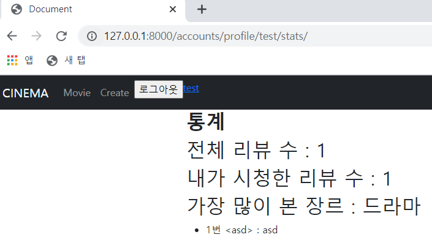

# 🛫 Done 🥳

<br>

#### ~~:one:. My Profile 통계 탭에 기능추가~~ --> 차트 추가는 아직 안함

#### ~~:two:. 회원정보 수정 페이지 -> 닉네임 변경기간 설정~~ --> 닉네임 변경 날짜는 설정해주었으나 일정 날짜 후에 닉네임을 변경할 수 있게 설정은 하지 않음

#### :three:. 비밀번호 수정 페이지 -> 전과 동일한 비밀번호로 변경 불가 --> 현재 비밀번호와 바꾼 비밀번호를 비교할 수 있는 방법을 찾아야함

#### :four: index, detail 페이지 -> 글 번호, 작성자 추가, index 페이지에 리뷰 개수 추가 --> 다음 프로젝트 때 구현

<br>

<br>

<br>

# :one: My Profile 통계 탭에 기능 추가

<br>

#### • 구현계획

1. ##### 시청한 리뷰 갯수, 전체 리뷰 갯수, 차트 추가, 댓글 수

   >전체 리뷰 갯수와 내가 시청한 리뷰 갯수를 보여줘서 
   >
   >전체 리뷰 중에 내가 어느정도의 리뷰를 봤는지 보여준다면
   >
   >사용자에게 내가 아직 볼 컨텐츠가 많구나 라고 느낄 수 있게 해주지 않을까? 이걸 차트로 시각화하면 어떨까?
   >
   >내가 본 리뷰 들 중 어떤 장르가 어느정도 차지하는지 파이차트로 보여주면 좋을 것 같다.
   >
   >내가 작성한 댓글 수 및 댓글 내용을 보여주면 좋을 듯하다
   >
   >어떤 게시글에 어떤 내용이 작성되어 있는지

<br>

#### • 실제 구현

1. ##### 전체 리뷰수, 내가 시청한 리뷰 수, 가장 많이 본 장르, 작성한 댓글 목록 구현

   >전체 댓글 수가 굳이 필요할까 라는 생각에 댓글 수를 보여주지는 않았고 
   >
   >내가 작성한 댓글은 볼 수 있게 해주었다.
   >
   ><br>
   >
   >전체 리뷰 수와 시청한 리뷰 수, 가장 많이 본 장르를 보여줬는데 
   >
   >장르별로 얼만큼 봤는지 차트로 표시해주면 좋을 것 같다.
   >
   >

<br>

<br>

<br>

# :two: 회원정보 수정 페이지 -> 닉네임 변경기간 설정

<br>

#### • 구현계획

1. ##### 닉네임 변경기간 설정

   >닉네임을 변경한 기간을 저장할 컬럼을 만들어서 
   >
   >현재 날짜와 컬럼에 저장된 날짜를 비교해서 일정 기간 이후에 닉네임 변경을 할 수 있도록 구성한다.

<br>

#### • 실제 구현

1. ##### 닉네임 변경기간은 설정했지만 기간에 따른 변경 여부는 아직 미설정

   >```python
   ># models.py
   >class User(AbstractUser):
   >    gender = models.BooleanField()
   >    nickname = models.CharField(max_length=20, unique=True)
   >    email = models.EmailField(unique=True)
   >    password_date = models.DateTimeField(auto_now_add=True)
   >    nickname_date = models.DateTimeField(auto_now_add=True)
   >```
   >
   ><br>
   >
   >닉네임 변경 기간을 저장해줄 컬럼을 만들었다.
   >
   >초기 값은 가입을 했을 때의 시간이 들어간다.
   >
   >```python
   ># views.py
   >def profile(request, nickname):
   >    user = get_user_model()
   >    if request.user == user.objects.get(nickname=nickname):
   >        if request.method == 'POST':
   >            form = CustomUserChangeForm(data=request.POST, instance=request.user)
   >            if form.is_valid():
   >                user_info = form.save(commit=False)
   >                if nickname != user_info.nickname:
   >                    user_info.nickname_date = datetime.now()
   >                user_info.save()
   >                return redirect('accounts:profile', user_info.nickname)
   >        else:
   >            form = CustomUserChangeForm(instance=request.user)
   >        context = {
   >            'form' : form,
   >        }
   >        return render(request, 'accounts/profile.html', context)
   >    else:
   >        return HttpResponse(status=404)
   >```
   >
   >if nick_name != user_info.nickname의 의미는 
   >
   >현재 닉네임과 수정한 닉네임이 같은 지 다른지를 확인해준다.
   >
   >만약 다르다면 닉네임을 수정한 것 이기 때문에 
   >
   >datetime.now()를 써서 수정한 시간을 nickname_date에 저장해준다.

<br>

<br>

<br>

# :three: 비밀번호 수정 페이지 -> 전과 동일한 비밀번호로 변경 불가

<br>

#### • 구현계획

1. ##### 기존과 같은 비밀번호로 변경 불가

   >PasswordChangeForm에서 새로 변경하고자 하는 비밀번호가 
   >
   >기존과 같은지 체크를 해주지 않는듯하다.
   >
   >비밀번호 변경 창을 보면 기존 비밀번호와 새로운 비밀번호를 입력하는 칸이 있다. 
   >
   >여기에 있는 칸의 값을 받아와서 두개의 값이 같다면 변경 불가능하게 설정해보자

<br>

#### • 실제 구현

1. ##### 구현 실패

   >기존 비밀번호와 변경한 비밀번호를 중간에서 가져올 수가 없었다.

2.  ##### 비밀번호 변경 기간 설정

   >비밀번호 변경 기간을 저장하는 컬럼을 만들어서 로그인을 할 때 
   >
   >비밀번호 변경 시점부터 현재 시간까지 15일이 초과 되었으면 
   >
   >비밀번호를 변경할 것인지 나중에 변경할 것인지 물어보는 창으로 전환하게 구성했다.
   >
   >```python
   ># models.py
   >class User(AbstractUser):
   >    gender = models.BooleanField()
   >    nickname = models.CharField(max_length=20, unique=True)
   >    email = models.EmailField(unique=True)
   >    password_date = models.DateTimeField(auto_now_add=True)
   >    nickname_date = models.DateTimeField(auto_now_add=True)
   >```
   >
   >password_date에 비밀번호 변경 시점을 저장해준다.
   >
   ><br>
   >
   >```python
   >def login(request):
   >    if request.user.is_authenticated:
   >        return redirect('contents:index')
   >    if request.method == 'POST':
   >        form = AuthenticationForm(request, request.POST)
   >        if form.is_valid():
   >            auth_login(request, form.get_user())
   >            if relativedelta(datetime.now(timezone.utc), form.get_user().password_date).days > 15:
   >                return redirect('accounts:password_alarm')
   >            return redirect('contents:index')
   >    else:
   >        form = AuthenticationForm()
   >    context = {
   >        'form' : form,
   >    }
   >    return render(request, 'accounts/login.html', context)
   >```
   >
   >로그인 시 
   >
   >if relativedelta(datetime.now(timezone.utc), form.get_user().password_date).days > 15:
   >
   >구문을 통하여 현재 시간과 마지막 비밀번호 변경 시간의 차이가 15일이 넘었는지 아닌지 체크해준다.
   >
   >timezone.utc는 현재 시간을 utc 시간으로 바꿔줘서 
   >
   >password_date에 저장되어 있는 date의 타입을 맞춰준다.
   >
   >relativedelta 메서드를 활용해서 첫번째 인자인 
   >
   >현재 시간과 두번째 인자인 마지막 변경 시간을 빼준 후 결과의 days만 가져온다.
   >
   ><br>
   >
   >```html
   >
   >
   >    <a href="">비밀번호 변경</a>
   >    <a href="">나중에 변경</a>
   >
   >```
   >
   >if문을 통과할 시에 password_alarm.html 페이지로 넘어간다.

<br>

<br>

<br>

# :four: index, detail 페이지 -> 글 번호, 작성자 추가, index 페이지에 리뷰 개수 추가

<br>

#### • 구현계획

1. ##### 게시글 정보 추가

   >글 번호와 작성자를 리뷰 갯수를 추가해서 가독성 있게 만들어보자

<br>

#### • 실제구현

1. ##### 다음 프로젝트 때 구현 예정

