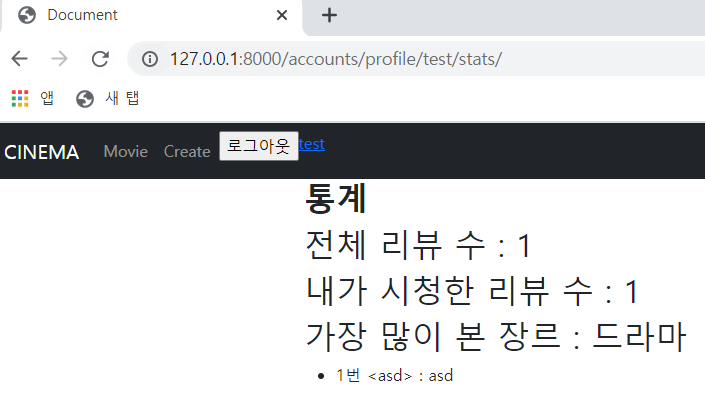

# 🛫 Done 🥳

<br>

#### ~~:one:. 닉네임 변경기간에 따른 변경 가능 여부 설정~~

#### ~~:two:. index, detail 페이지 -> 글 번호, 작성자 추가, index 페이지에 리뷰 개수 추가~~

#### ~~:three:. 로그인한 상태에서 url로 signup을 들어 갈수 없게 설정~~

#### ~~:four:. 처음 로그인할 시 통계 탭에 index 에러 수정~~

#### ~~:five:. 통계 탭에 작성한 댓글을 클릭 시 그 글로 이동할 수 있게 설정~~

#### :six:. 작성한 게시글에 댓글 달릴 시 알림 설정   --> 다음 프로젝트 때 진행

<br>

<br>

<br>

# :one: 닉네임 변경기간에 따른 변경 가능 여부 설정

<br>

#### • 구현계획

1. ##### 15일 마다 한번씩 닉네임을 바꿀 수 있게 설정

   >15일이 지나지 않았을 경우 닉네임을 변경할 수 있는 창을 비활성화하는 등의
   >
   >다양한 방법으로 변경을 막아보자

<br>

#### • 실제 구현

1. ##### 15일 마다 한번씩 닉네임을 바꿀 수 있게 설정

   >```python
   ># views.py
   >def profile(request, nickname):
   >    user = get_user_model()
   >    if request.user == user.objects.get(nickname=nickname):
   >        if request.method == 'POST':
   >            form = CustomUserChangeForm(data=request.POST, instance=request.user)
   >            if form.is_valid():
   >                user_info = form.save(commit=False)
   >                if nickname != user_info.nickname:
   >                    user_info.nickname_date = datetime.now()
   >                user_info.save()
   >                return redirect('accounts:profile', user_info.nickname)
   >        else:
   >            form = CustomUserChangeForm(instance=request.user)
   >            date_period = 15 - relativedelta(datetime.now(timezone.utc), request.user.nickname_date).days
   >        
   >        context = {
   >            'form' : form,
   >            'date_period' : date_period,
   >        }
   >        return render(request, 'accounts/profile.html', context)
   >    else:
   >        return HttpResponse(status=405)
   >```
   >
   >>```python
   >>date_period = 15 - relativedelta(datetime.now(timezone.utc), request.user.nickname_date).days
   >>```
   >>
   >>위의 코드를 활용하여 현재시간과 마지막으로 닉네임을 바꾼 날을 빼서 
   >>
   >>몇일 후에 닉네임을 바꿀 수 있는지 date_period에 할당해준다.
   >
   ><br>
   >
   >```html
   ># profile.html
   >
   >
   >
   >    <form action="" method='POST'>
   >        
   >        <label for="nickname"></label>
   >        
   >            <p>닉네임 : <input type="text" name="nickname" id="nickname" value={{ request.user.nickname }}></p>
   >        
   >            <p>닉네임 : {{ request.user.nickname }} -> {{ date_period }}일 후부터 변경 가능</p>
   >        
   >        {{ form.as_p }}
   >        <input type="submit" value="수정하기">
   >    </form>
   >    <a href="">좋아요 페이지</a>
   >    <a href="">나중에 페이지</a>
   >    <a href="">통계 페이지</a>
   >
   >```
   >
   >>```html
   >><label for="nickname"></label>
   >>        
   >>            <p>닉네임 : <input type="text" name="nickname" id="nickname" value={{ request.user.nickname }}></p>
   >>        
   >>            <p>닉네임 : {{ request.user.nickname }} -> {{ date_period }}일 후부터 변경 가능</p>
   >>        
   >>```
   >>
   >>닉네임 칸을 form에서 분리한 이유는 닉네임 변경기간이 지나지 않았을 경우
   >>
   >>비활성화해야 하기 때문에 form과 분리해주었다.
   >>
   >>15일이 지난 당일부터 변경 가능하고 아닐 경우
   >>
   >>닉네임을 보여주고 몇일 후부터 변경 가능한지 알려준다.

<br>

<br>

<br>

# :two: index, detail 페이지 -> 글 번호, 작성자 추가, index 페이지에 리뷰 개수 추가

<br>

#### • 구현계획

1. ##### 게시글 정보 추가

   >글 번호와 작성자, 리뷰 갯수를 추가해서 가독성 있게 만들어보자

<br>

#### • 실제 구현

1. ##### 게시글 정보 추가

   >글 번호와 작성자, 리뷰 갯수 추가 완료
   >
   >
   >
   ><br>
   >
   >```html
   >
   >
   >
   >    
   >        <a href="">글쓰기</a>
   >        <hr>
   >    
   >    
   >        <p>글 번호 : {{ content.id }}</p>
   >        <p>제목 : <a href="">{{ content.title }}</a></p>
   >        <p>작성자 : {{ content.user.nickname }}</p>
   >        <p>리뷰 개수 : {{ content.review_set.all|length}}</p>
   >        
   >        <hr>
   >    
   >
   >```
   >
   >ORM을 활용하여 작성자 닉네임과 리뷰 갯수를 역참조하여 가져왔다.

<br>

<br>

<br>

# :three: 로그인한 상태에서 url로 signup을 들어 갈수 없게 설정

<br>

#### • 구현계획

1. ##### signup 메서드 수정

   >accounts의 views.py에 있는 signup 메서드를 수정해준다.
   >
   >is_authenticated를 활용하여 로그인 여부를 체크해주고 로그인 했으면
   >
   >요청이 온 페이지로 redirect를 해줄 지 아니면
   >
   >로그아웃 후 회원가입을 시도해달라고 할지 결정해보자
   >
   >signup 페이지 말고도 로그인한 상태에서 login 페이지에 들어 간다면
   >
   >현재는 index로 redirect 해주지만 어느 페이지로 redirect 해줄 지 생각해보자 

<br>

#### • 실제 구현

1. ##### signup 메서드 수정

   >요청이 온 페이지로 redirect를 해주려 했으나 하지 못했다.
   >
   >요청온 페이지 정보를 담아서 보내주는 방법과 
   >
   >request안에 요청 온 페이지 정보가 있는지 찾아봤다.
   >
   ><br>
   >
   >요청온 페이지 정보를 담아서 보내주려면 
   >
   >어느 페이지에서 signup으로 들어올지 모르기 때문에
   >
   >모든 페이지에서 현재 페이지의 url을 가지고 있고 
   >
   >이동하는 페이지 마다 페이지 정보를 보내줘야 한다.
   >
   >이는 비효율적이라고 판단해서 405페이지로 이동하게 구성했다.
   >
   >request안에는 요청을 한 페이지 정보는 찾지 못했다.
   >
   ><br>
   >
   >```python
   ># views.py
   >def signup(request):
   >    if not request.user.is_authenticated:
   >        if request.method == 'POST':
   >            form = CustomUserCreationForm(request.POST)
   >            if form.is_valid():
   >                user = form.save()
   >                auth_login(request, user)
   >                return redirect('contents:index')
   >        else:
   >            form = CustomUserCreationForm()
   >        context = {
   >            'form' : form,
   >        }
   >        return render(request, 'accounts/signup.html', context)
   >    else:
   >        return HttpResponse(status=405)
   >
   >```


<br>

<br>

<br>

# :four: 처음 로그인할 시 통계 탭에 index 에러 수정

<br>

#### • 구현계획

1. ##### 통계를 산출하는 orm문에서 index 에러 발생

   >##### Error 화면
   >
   >
   >
   ><br>
   >
   >```python
   ># views.py
   >
   >def mystats(request, nickname):
   >if request.user.nickname == nickname:
   >   watched_reviews = request.user.watched_reviews.all()
   >   max_genre = watched_reviews.values('genre').annotate(genre_count=Count('genre')).order_by('-genre_count')[0]['genre']
   >   watched_reviews_num = watched_reviews.count()
   >   total_reviews = Review.objects.all().count()
   >   comments = request.user.comment_set.all()
   >   context = {
   >       'max_genre' : max_genre,
   >       'total_reviews' : total_reviews,
   >       'watched_reviews_num' : watched_reviews_num,
   >       'comments' : comments,
   >   }
   >   return render(request, 'accounts/mydata.html', context)
   >else:
   >   return HttpResponse(status=404)
   >```
   >
   >>```python
   >>max_genre = watched_reviews.values('genre').annotate(genre_count=Count('genre')).order_by('-genre_count')[0]['genre']
   >>```
   >
   >>여기에서 [0] index를 가져오는 과정에서 에러가 나는 듯하다.
   >
   >>처음에 회원가입 시에는 아무 데이터도 없는데 indexing을 하니까 list index out of range에러가 발생한다.

<br>

#### • 실제구현

1. ##### 통계를 산출하는 orm문에서 index 에러 발생

   >가장 많이 본 장르를 뽑아주는 orm 변경
   >
   ><br>
   >
   >기존
   >
   >```python
   >watched_reviews = request.user.watched_reviews.all()
   >   max_genre = watched_reviews.values('genre').annotate(genre_count=Count('genre')).order_by('-genre_count')[0]['genre']
   >   watched_reviews_num = watched_reviews.count()
   >```
   >
   ><br>
   >
   >변경 후
   >
   >```python
   >watched_reviews = request.user.watched_reviews.all()
   >        if not watched_reviews:
   >            max_genre = '데이터가 없습니다.'
   >            watched_reviews_num = 0
   >        else:
   >            max_genre = watched_reviews.values('genre').annotate(genre_count=Count('genre')).latest('genre_count').get('genre')
   >            watched_reviews_num = watched_reviews.count()
   >```
   >
   >>처음 가입한 고객이거나 시청기록이 없는 고객일 경우 가장 많이 본 장르의 산출이 어렵다.
   >>
   >>아무 값도 없는데 인덱싱을 활용해서 값을 가져왔기 때문에 index error가 나서
   >>
   >>orm문을 수정했다.
   >>
   >>latest함수가 주요했는데 원래는 date형식에서 최근의 날짜를 가져오기 위해 쓰인다.
   >>
   >>하지만 가장 큰 값을 가져오는 성질 때문에 int에서도 가장 큰 값을 가져와서 활용할 수 있었다.
   >>
   >>max를 쓸 수도 있었지만 max와 관련된 컬럼이 하나 더 만들어지고 장르명을 같이 가져올 수 없어서
   >>
   >>latest를 써주었다.

<br>

<br>

<br>

# :five: 통계 탭에 작성한 댓글을 클릭 시 그 글로 이동할 수 있게 설정

<br>

#### • 구현계획

1. ##### 댓글을 클릭 시 해당 글로 이동할 수 있게 구현

   >#### 통계화면
   >
   >
   >
   >1번 <asd> : asd 에서 제목을 뜻하는 <asd>를 클릭 시 해당 글로 이동할 수 있게한다.
   >
   >수정은 아직 불가하지만 삭제나 새로 작성할 수 있게 구성

<br>

#### • 실제 구현

1. ##### 댓글을 클릭 시 해당 글로 이동할 수 있게 구현

   >```HTML
   >
   >        <h2><b>내가 작성한 댓글</b></h2>
   >        <ul>
   >            
   >                <li>
   >                    {{ comment.content.pk }}번 
   >                    <a href="">&lt;{{ comment.content.title }}&gt;</a>: {{ comment.text }}
   >                </li>
   >            
   >        </ul>
   >```
   >
   >게시글의 제목을 a태그로 감싸서 제목을 클릭할 경우 
   >
   >해당 글의 detail 페이지로 이동할 수 있게 구성했다.

<br>

<br>

<br>