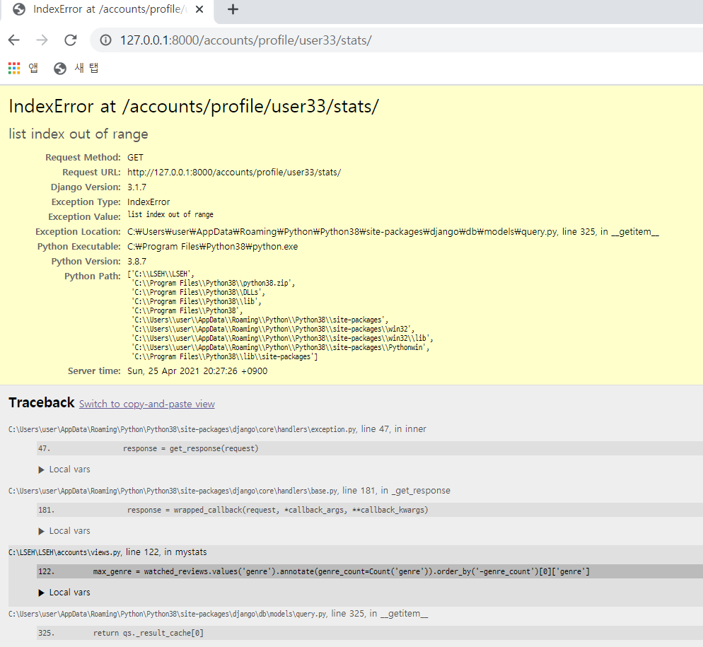
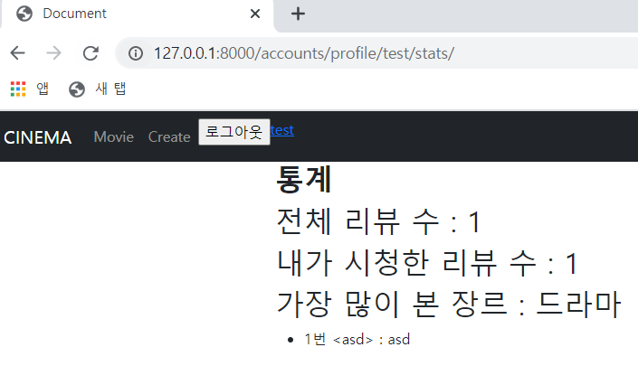

# 📃 Todo 🥳

<br>

#### :one:. 닉네임 변경기간에 따른 변경 가능 여부 설정

#### :two:. index, detail 페이지 -> 글 번호, 작성자 추가, index 페이지에 리뷰 개수 추가

#### :three:. 로그인한 상태에서 url로 signup을 들어 갈수 없게 설정

#### :four:. 처음 로그인할 시 통계 탭에 index 에러 수정

#### :five:. 통계 탭에 작성한 댓글을 클릭 시 그 글로 이동할 수 있게 설정

#### :six:. 작성한 게시글에 댓글 달릴 시 알림 설정

<br>

<br>

<br>

# :one: 닉네임 변경기간에 따른 변경 가능 여부 설정

<br>

#### • 구현계획

1. ##### 15일 마다 한번씩 닉네임을 바꿀 수 있게 설정

   >15일이 지나지 않았을 경우 닉네임을 변경할 수 있는 창을 비활성화하는 등의
   >
   >다양한 방법으로 변경을 막아보자


<br>

<br>

<br>

# :two: index, detail 페이지 -> 글 번호, 작성자 추가, index 페이지에 리뷰 개수 추가

<br>

#### • 구현계획

1. ##### 게시글 정보 추가

   >글 번호와 작성자를 리뷰 갯수를 추가해서 가독성 있게 만들어보자

<br>

<br>

<br>

# :three: 로그인한 상태에서 url로 signup을 들어 갈수 없게 설정

<br>

#### • 구현계획

1. ##### signup 메서드 수정

   >accounts의 views.py에 있는 signup 메서드를 수정해준다.
   >
   >is_authenticated를 활용하여 로그인 여부를 체크해주고 로그인 했으면 
   >
   >요청이 온 페이지로 redirect를 해줄 지 아니면 
   >
   >로그아웃 후 회원가입을 시도해달라고 할지 결정해보자
   >
   >signup 페이지 말고도 로그인한 상태에서 login 페이지에 들어 간다면 
   >
   >현재는 index로 redirect 해주지만 어느 페이지로 redirect 해줄 지 생각해보자 

<br>

<br>

<br>

# :four: 처음 로그인할 시 통계 탭에 index 에러 수정

<br>

#### • 구현계획

1. ##### 통계를 산출하는 orm문에서 index 에러 발생

   >##### Error 화면
   >
   >
   >
   ><br>
   >
   >```python
   ># views.py
   >
   >def mystats(request, nickname):
   >    if request.user.nickname == nickname:
   >        watched_reviews = request.user.watched_reviews.all()
   >        max_genre = watched_reviews.values('genre').annotate(genre_count=Count('genre')).order_by('-genre_count')[0]['genre']
   >        watched_reviews_num = watched_reviews.count()
   >        total_reviews = Review.objects.all().count()
   >        comments = request.user.comment_set.all()
   >        context = {
   >            'max_genre' : max_genre,
   >            'total_reviews' : total_reviews,
   >            'watched_reviews_num' : watched_reviews_num,
   >            'comments' : comments,
   >        }
   >        return render(request, 'accounts/mydata.html', context)
   >    else:
   >        return HttpResponse(status=404)
   >```
   >
   >>```python
   >>max_genre = watched_reviews.values('genre').annotate(genre_count=Count('genre')).order_by('-genre_count')[0]['genre']
   >>```
   >>
   >>여기에서 [0] index를 가져오는 과정에서 에러가 나는 듯하다.
   >>
   >>처음에 회원가입 시에는 아무 데이터도 없는데 indexing을 하니까 list index out of range에러가 발생한다.

<br>

<br>

<br>

# :five: 통계 탭에 작성한 댓글을 클릭 시 그 글로 이동할 수 있게 설정

<br>

#### • 구현계획

1. ##### 댓글을 클릭 시 해당 글로 이동할 수 있게 구현

   >#### 통계화면
   >
   >
   >
   >1번 <asd> : asd 에서 제목을 뜻하는 <asd>를 클릭 시 해당 글로 이동할 수 있게한다.
   >
   >수정은 아직 불가하지만 삭제나 새로 작성할 수 있게 구성

   <br>

   <br>

   <br>

   # :six: 작성한 게시글에 댓글 달릴 시 알림 설정

   <br>

   #### • 구현계획

   1. ##### 댓글의 작성한 날짜를 활용해보자

      >작성한 날짜가 최근으로부터 1일 이내일 경우 
      >
      >새로운 댓글이라고 표시<모두가 볼 수 있게 댓글에 직접 표시>
      >
      ><br>
      >
      >작성자에게는 알림을 따로 만들어서 새로운 댓글이 달렸다고 알림

   