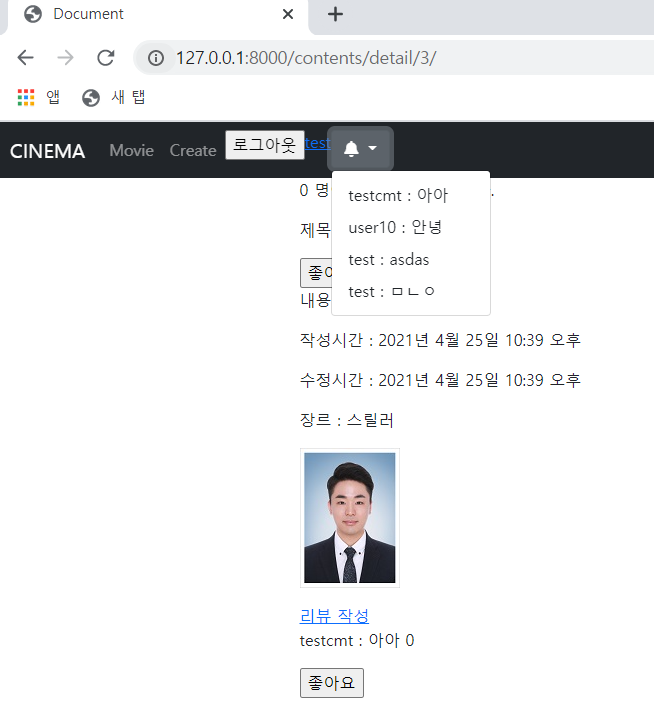

# 🛫 Done 🥳

<br>

#### ~~:one:. 작성한 게시글에 댓글 달릴 시 알림 설정~~  --> 작성한 게시글에 일주일 이내 댓글은 새 페이지에서는 확인 가능 하나 버튼을 누를 때 댓글을 불러오진 못함

#### ~~:two:. 유튜브 API 활용해보기~~ -> API키를 받아서 영상 목록까지 확인

#### :three:. 넷플릭스 API 활용해보기

<br>

<br>

# :one: 작성한 게시글에 댓글 달릴 시 알림 설정

<br>

#### • 구현계획

1. 댓글의 작성한 날짜를 활용해보자

   >작성한 날짜가 최근으로부터 1일 이내일 경우 
   >
   >새로운 댓글이라고 표시<모두가 볼 수 있게 댓글에 직접 표시>
   >
   >작성자에게는 알림을 따로 만들어서 새로운 댓글이 달렸다고 알림
   >
   ><br>

2. ##### 작성자에게 알림 보내기

   >게시글에 댓글이 달릴 경우 알려주면 의사소통에 도움이 될 것이라고 생각
   >
   >그러면 알림 테이블을 따로 만들어서 새로운 댓글이 달릴 경우에 알림 테이블에 같이 추가를 해준다.
   >
   >작성자가 확인을 하고 X를 누르면 테이블에서 삭제를 해줘서 
   >
   >알림이 더이상 뜨지 않도록 구성해보자

<br>

#### • 실제 구현

1. ##### 댓글의 날짜를 활용해보자

-> 추후 구현

<br>

2. ##### 작성자에게 알림 보내기

   >```python
   >def comment_alarm(request):
   >    contents = request.user.content_set.all()
   >    today = datetime.now()
   >    comments = []
   >    for content in contents:
   >        data = content.comment_set.filter(created_at__gte=(today - timedelta(days=7)))
   >        for comment in data:
   >            comments.append(comment)
   >    comments.sort(key= lambda x : x.created_at, reverse=True)
   >    context = {
   >        'comments' : comments,
   >    }
   >    return render(request, 'nav.html', context)
   >```
   >
   >유저가 쓴 글을 모두 받아 온 뒤에
   >
   >그 글 안에 있는 댓글들 중 현재 날짜와 7일 이하로 차이나는 댓글 들을 받아 온다.
   >
   >댓글 들을 날짜 순으로 정렬한 뒤에 저장해주는 구조이다.
   >
   >filter 다음에 order_by를 써서 created_at으로 정렬할 수는 없었을까?
   >
   >nav에 알림을 표시하기 위해서 nav.html에 context를 보내준다.
   >
   ><br>
   >
   >```html
   >
   >    <li>
   >        <div class="dropdown">
   >            <button class="btn btn-secondary dropdown-toggle" type="button" id="dropdownMenuButton1" data-bs-toggle="dropdown" aria-expanded="false">
   >                <i class="fas fa-bell"></i>
   >            </button>
   >            <ul class="dropdown-menu" aria-labelledby="dropdownMenuButton1">
   >                
   >                    <li><a class="dropdown-item" href="#">{{ comment.user.nickname }} : {{ comment.text }}</a></li>
   >                
   >            </ul>
   >        </div>
   >    </li>
   >
   >```
   >
   >nav.html에 위와 같이 추가해줬으나 의도한 바와 달리 페이지를 전환할 때 마다 
   >
   >알림창이 생겼다 없어졌다하는 현상이 발생했다.
   >
   >또한 사용자의 글에 달린 댓글이 보이는 것이 아닌 다른 게시물로 이동할 때 마다
   >
   >그 글의 댓글이 보여지는 상황이 발생했따.
   >
   >
   >
   >추후에 수정이 필요하다.

<br>

<br>

<br>

# :two: 유튜브 API 활용해보기

<br>

#### • 구현계획

1. ##### 유튜브 영상 수집

   >크롤링과 api 방법이 있는데
   >
   >크롤링의 경우에는 태그 값의 변동 등의 문제로 
   >
   >만들어놓은 크롤링 코드가 잘 동작하지 않을 수 있는 문제가 있고 기술, 시간적인 문제가 존재
   >
   >API가 가능하다면 API가 더욱 효율적으로 작동할 것 이라고 생각

<br>

#### • 실제 구현

1. 유튜브 영상 수집

   >```python
   >def youtube():
   >    url = ' https://www.googleapis.com/youtube/v3/search'
   >    params = {
   >        'key': '',
   >        'part': 'snippet',
   >        'type': 'video',
   >        'maxResults': '10',
   >        'q': '아이유',
   >    }
   >    response = requests.get(url, params)
   >    response_dict = response.json()
   >
   >    print(response_dict['items'])
   >    context = {
   >        'youtube_items': response_dict['items']
   >    }
   >    return render(request, 'youtube.html', context)
   >
   >youtube()
   >```
   >
   >유튜브 API를 활용해서 데이터를 가져와봤다.
   >
   >가공해서 쓰려면 추가적인 작업이 필요하다

<br>

<br>

<br>

# :three: 넷플릭스 API 활용해보기

<br>

#### • 구현계획

1. ##### 넷플릭스 컨텐츠 수집

   >크롤링과 api 방법이 있는데
   >
   >크롤링의 경우에는 태그 값의 변동 등의 문제로 
   >
   >만들어놓은 크롤링 코드가 잘 동작하지 않을 수 있는 문제가 있고 기술, 시간적인 문제가 존재
   >
   >API가 가능하다면 API가 더욱 효율적으로 작동할 것 이라고 생각

<br>

#### • 실제 구현

1. 다음 프로젝트에서 구현